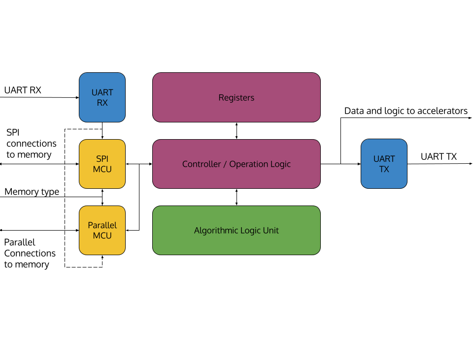

<!---

This file is used to generate your project datasheet. Please fill in the information below and delete any unused
sections.

You can also include images in this folder and reference them in the markdown. Each image must be less than
512 kb in size, and the combined size of all images must be less than 1 MB.
-->

## What is Zoom Zoom?

Zoom Zoom is a custom, 16-bit, barebones CPU. We store memory externally using either a custom parallel connection or SPI. We also have a simple UART protocal implemented on the CPU as well as numerous accelerators(that may not be included in the final design due to size constraints).

## Detailed List of Features

- Custom Architecture and ISA
  - 16-bit instructions
  - 5 types of instructions
- 6 general purpose registers
  - 1 flag register
  - 1 zero register
- UART Interface
- SPI and Custom Parallel Memeroy Interface
  - 16 bit memory address
  - supports up to 65536 memory addresses(2^16)
- Flexible design easy integration of accelerators as instructions

## The Architecture

### Instruction Layout

### General Instructions

| Instruction |      Name      | Type  | Opcode | Settings | Description                       |
| :---------- | :------------: | :---: | :----: | :------: | :-------------------------------- |
| nop         |  No Operation  |   0   |  0000  |          |                                   |
| ld          |      Load      |   A   |  0101  |    0     | reg out = mem[mem[inst addr + 1]] |
| ldr         | Load Register  |   A   |  0101  |    1     | reg out = mem[reg1]               |
| str         |     Store      |   A   |  0110  |    0     | mem[mem[inst addr + 1]] = reg2    |
| strr        | Store Register |   A   |  0110  |    1     | mem[reg1] = reg2                  |
| ldi         | Load Immediate |   L   |  0111  |          | reg out = L9[7:15]                |

### ALU Instructions

| Instruction |        Name        | Type  | Opcode | Settings | Description                      |
| :---------- | :----------------: | :---: | :----: | :------: | :------------------------------- |
| add         |        Add         |   A   |  0001  |   000    | reg out = reg1 + reg2            |
| sub         |      Subtract      |   A   |  0001  |   001    | reg out = reg1 - reg2            |
| mult        |      Multiply      |   A   |  0001  |   010    | reg out = reg1[0:7] * reg 2[0:7] |
| nand        |        NAND        |   A   |  0001  |   011    | reg out = !(reg1 & reg2)         |
| addi        |   Add Immediate    |   I   |  0010  |    0     | reg out = register 2 + L8[0:7]   |
| multi       | Multiply Immediate |   I   |  0010  |    1     | reg out = register 2 * L8[0:7]   |
| shl         |     Shift Legt     |   A   |  0001  |   100    | reg out = reg1 << 0              |
| shr         |    Shift Right     |   A   |  0001  |   101    | reg out = reg1 >> 0              |

### Branching Instructions

| Instruction |          Name          | Type  | Opcode | Settings | Description                                        |
| :---------- | :--------------------: | :---: | :----: | :------: | :------------------------------------------------- |
| jmp         |          Jump          |   A   |  0100  |   000    | inst addr = reg1                                   |
| jmpz        |      Jump if Zero      |   A   |  0100  |   001    | reg_out = inst addr; if (ZF) { inst addr = reg1 }  |
| jmpg        |    Jump if Greater     |   A   |  0100  |   010    | reg_out = inst addr; if (GF) { inst addr = reg1 }  |
| jmpe        |     Jump if Equal      |   A   |  0100  |   111    | reg_out = inst addr; if (EF) { inst addr = reg1 }  |
| jmpl        |      Jump if Less      |   A   |  0100  |   011    | reg_out = inst addr; if (!GF) { inst addr = reg1 } |
| jmpm        | Jump if Memory Flagged |   A   |  0100  |   100    | reg_out = inst addr; if (MF) { inst addr = reg1 }  |
| jmpu        |  Jump if UART Flagged  |   A   |  0100  |   101    | reg_out = inst addr; if (UF) { inst addr = reg1 }  |
| jmpi        |    Jump   Immediate    |   A   |  0100  |   110    | inst addr = mem[inst addr + 1]                     |

## Programming the CPU

## How to test

Generate the binary file from test/x3q16 and load it into memory. Reset the chip and see if anything is written in memory.

## External hardware

Either a SPI ram chip or a MCU emulator of parallel storage with custom protocol
